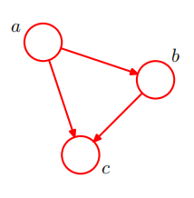

# 8.1 Bayesian Networks
## product rule
$$
p(a,b,c) = p(c \mid a,b)p(a,b) = p(c \mid a,b)p(b \mid a)p(a)
$$
上面的使用图模型来表示：

- 注意到一个问题：在式子中，a,b,c是同等的关系，但是在图中三种的关系并不同等

## 8.1.1 多项式回归(Polynomial regression)
